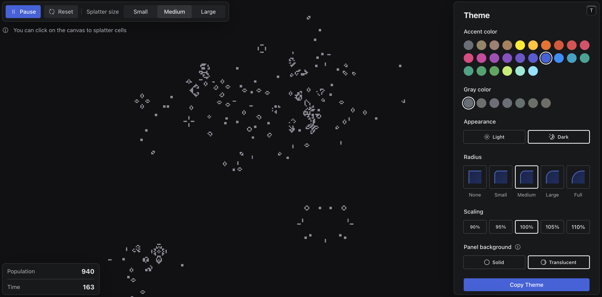

# Conversion CalHacks Demo - EternalGameOfLife

This is a tutorial for using temporals signal system to coordinate an event driven UI in a durable long lived game of life.

The game of life is composed of some very simple, deterministic rules

1. Any live cell with fewer than two live neighbours dies, as if by underpopulation.
2. Any live cell with two or three live neighbours lives on to the next generation.
3. Any live cell with more than three live neighbours dies, as if by overpopulation.
4. Any dead cell with exactly three live neighbours becomes a live cell, as if by reproduction.

Note: This is NOT a good use case for temporal

The Goal of this excersize is to implement the Splatter method for the game of life where a user can click a square and a random amount of cells appear.

1. Create a new selector branch within the main game loop.
2. Implement the splatter activity for the splatter signal.

## Requirements

- Download [go](https://go.dev/dl/). Follow the suggested instructions or use your packaege manager like below

  ```shell
  # macOS
  brew install go

  # Windows
  scoop install go
  ```

- Download [Temporal](https://learn.temporal.io/getting_started/go/dev_environment). Follow the suggested instructions or use your package manager like below

  ```shell
  # macOS
  brew install temporal

  # Windows
  scoop install temporal
  ```

- Optionally, download [Node](https://nodejs.org/en/download) and [pnpm](https://pnpm.io/installation) for the frontend. Follow the suggested instructions or use your packaege manager like below

  ```shell
  # macOS
  brew install node
  npm install -g pnpm

  # Windows
  scoop install nodejs
  npm install -g pnpm
  ```

## Running

- Run Temporal on port 7233 (the port can be changed in [main.go](./backend/main.go)). The UI will be available at http://localhost:8233

  ```shell
  temporal server start-dev
  ```

- Run the Go backend on port 8080

  ```shell
  cd backend
  go run .
  ```

- Optionally, run the React frontend on port 5173 (default for Vite): https://localhost:5173
  ```shell
  cd frontend
  pnpm install
  pnpm run dev
  ```
- If you opt to not use the frontend, Decrease the board size to 40 X 40 and print to the terminal
